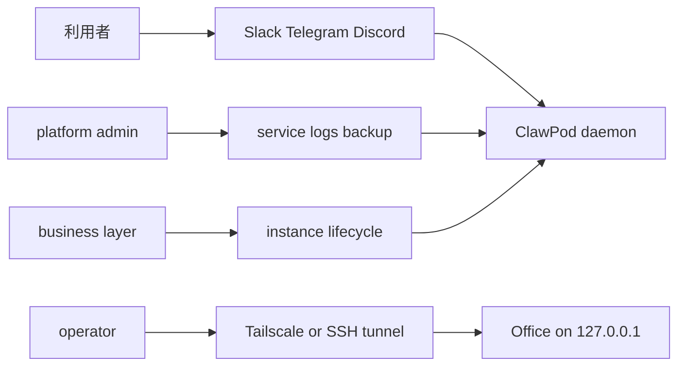
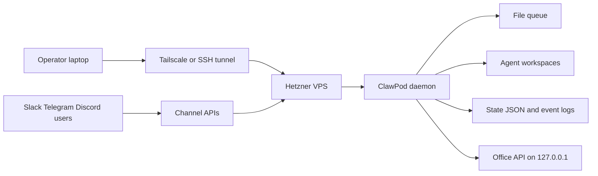

# ClawPod 設計書

この文書は、`experiments/clawpod` を業務利用できる常駐 agent runtime として育てるための設計判断をまとめたものです。使い方ではなく、`どの路線を採るか`、`Hetzner でどう置くか`、`どこまで実装が必要か` を定義します。

## 1. 結論

ClawPod は次の方針で設計する。

- 運用モデルは `ZeroClaw` 路線
- operator 体験は `TinyClaw` 路線
- harness 設計は Anthropic の `Effective harnesses for long-running agents` を参考にする
- `OpenClaw` の remote gateway 思想は、`loopback bind + private remote access` の部分だけ借りる

つまり、`軽い常駐 runtime` を中心に置き、その上に `team / channel / office` を載せる。最初から巨大な personal OS や multi-device platform にしない。

## 2. 想定ユースケース

最初に狙うのは `社内 single-tenant` の業務利用である。

- 社内 Slack / Telegram / Discord から業務メッセージを受ける
- team 単位で agent にルーティングする
- Office で設定、タスク、イベント、手動応答を確認する
- Hetzner などの VPS に常駐させる

現時点では `外販 SaaS` は想定しない。tenant 分離、課金、顧客ごとの secret 隔離、公開 API 管理は別段階の設計とする。

### 2.1 実行時の actor

実行時に登場する actor は次の 4 つである。

- `利用者`: Slack / Telegram / Discord から業務メッセージを送る人
- `operator`: Office を見て設定、タスク、イベント、手動応答を扱う人
- `platform admin`: VPS、service、logs、backup を管理する人
- `business layer`: 将来、organization / instance / billing を扱う外側の control plane

### 2.2 利用者ユースケース

利用者から見た runtime の中心ユースケースは、`チャネル経由で話しかけると team / agent が処理して返す` ことである。

- メッセージは Slack / Telegram / Discord から入る
- daemon が queue へ取り込む
- routing が `@agent` / `@team` / binding で担当を決める
- agent が session / workspace を復元して 1 回実行される
- 応答は outgoing queue へ出て、元チャネルへ返る

### 2.3 Operator ユースケース

operator から見た runtime の中心ユースケースは、`private Office で運用状態を確認し、必要なら手動介入する` ことである。

- settings を確認し、必要なら更新する
- agents / teams / queue status / tasks / events を見る
- chatroom の状況を見る
- 必要なら手動応答を投入する
- Office は public に出さず、`Tailscale` か `SSH tunnel` 経由で入る

### 2.4 Platform Admin ユースケース

platform admin から見た runtime の中心ユースケースは、`単一 VPS 上の service とデータを維持する` ことである。

- `clawpod daemon` を常駐させる
- 将来的には `service install/start/stop/status` で supervise する
- status / logs / health で障害切り分けをする
- workspace、state、event log を backup する
- Office は loopback bind のまま維持する

### 2.5 Business Layer ユースケース

`business layer` は ClawPod core の実行時ユースケースではないが、将来は外側で次を扱う。

- organization / member の認証
- instance の作成 / 起動 / 停止
- secret 配布
- billing
- provisioning

つまり、ClawPod core の runtime は `1 instance がメッセージを処理すること` に集中し、`誰の instance か`、`誰が課金するか`、`何台作るか` は外側で扱う。

## 3. 設計原則

### 3.1 Runtime First

中心は `daemon` である。agent は常駐プロセスではなく、メッセージごとに session / workspace を復元して実行する単位とする。

### 3.2 Private By Default

制御面は外へ公開しない。Office / API は loopback bind を基本とし、公開は reverse proxy や tunnel 側で判断する。

### 3.3 Single Node First

最初は 1 台の VPS で完結する設計を優先する。queue、state、workspace は単一ノードで整合することを先に重視する。

### 3.4 Harness Over Orchestration

長時間動く agent の品質は、tmux や queue の複雑さではなく harness で決まる。初期化、進捗 artifact、増分実行、clean exit を agent workspace に持たせる。

### 3.5 Observable Operations

業務利用では、`動くこと` より `止まった時に切り分けられること` が重要である。status、logs、health、event stream を必須機能として扱う。

## 4. 参考にする路線

### 4.1 ZeroClaw から借りるもの

- 単一バイナリの常駐 runtime
- `service install/start/stop/status`
- `allow_public_bind` のような明示 opt-in
- tunnel を含む network deployment の考え方
- 小さな VPS で回ることを前提にした設計

### 4.2 TinyClaw から借りるもの

- `@agent` / `@team` 中心の運用体験
- chatroom
- Office 的な軽い operator UI
- Slack など実チャネルを agent team へ流す UX

### 4.3 OpenClaw から借りるもの

- `loopback bind + remote access` を基本にする考え方
- `always-on gateway on VPS` という配置
- CLI に status / doctor / logs を寄せる方針

### 4.4 今は借りないもの

- device nodes
- Canvas
- voice / companion apps
- public dashboard 前提の構成
- multi-device control plane

### 4.5 参照優先順位

単一で 1 つ選ぶなら、ClawPod 本体の最重要参照は `ZeroClaw` とする。理由は、今の ClawPod の課題が `daemon`、`service`、`status`、`logs`、`public bind`、`tunnel` といった運用面に集中しており、ここが最も近いからである。

優先順位は次のとおり。

1. `ZeroClaw`
2. `openclaw-business`
3. `TinyClaw`
4. `OpenClaw`

役割分担は次のとおり。

- `ZeroClaw`: core runtime / VPS 運用 / service 管理 / bind 方針
- `openclaw-business`: 将来の business layer。organization、member、instance、billing、provisioning の責務分離
- `TinyClaw`: `@agent` / `@team` / Office / chatroom の operator 体験
- `OpenClaw`: `loopback bind + private remote access` の配置思想

### 4.6 openclaw-business の位置づけ

`openclaw-business` は ClawPod 本体の直接の参照先ではない。これは `Rust の常駐 runtime` ではなく、`B2B SaaS control plane` の参照である。

したがって、現段階では次だけを借りる。

- organization / member / instance の分離
- setup phase を持つ instance lifecycle
- billing と provisioning を runtime から分ける考え方

逆に、当面は次を持ち込まない。

- AWS ECS Fargate 前提
- Stytch / Supabase / Stripe 前提
- multi-tenant SaaS 前提の公開 control plane

## 5. Hetzner 配置の基本形

推奨トポロジは次のとおり。

運用ルール:

- `clawpod daemon` は Hetzner 上で 24/7 常駐
- Office は `127.0.0.1` に bind
- operator は `ssh -L` または `Tailscale` で Office に入る
- public firewall は最小化する
- Slack / Telegram / Discord connector は daemon 内で同居させる

## 6. セキュリティ方針

### 6.1 Bind 方針

- default は `127.0.0.1`
- `0.0.0.0` は将来入れるとしても `allow_public_bind = true` の明示 opt-in
- 認証なしの public bind は禁止

### 6.2 Secret 方針

- bot token や provider API key を長期的には config 直書きしない
- env file、systemd credential、または secret manager 経由へ寄せる
- Office の設定 API で secret を平文 round-trip させない

### 6.3 Workspace 方針

- agent ごとに working directory を分離
- session は agent ごとに分離
- 業務データは必要最小限だけ各 workspace に置く

### 6.4 Remote Access 方針

- 最優先は `Tailscale`
- 次点は `SSH tunnel`
- reverse proxy や public HTTPS は、認証・監査が揃ってから

## 7. Harness 方針

Anthropic の long-running harness 論文に寄せて、agent workspace には次を標準化する。

### 7.1 Initializer

初回 bootstrap 時に次を作る。

- `AGENTS.md`
- `heartbeat.md`
- `.clawpod/SOUL.md`
- `memory/`
- `sessions/`
- `progress.md` または `progress.json`
- `features.json`

### 7.2 Session Start Protocol

各 run の開始時に agent が確認するものを固定する。

- 現在の task
- progress artifact
- 直近の変更履歴
- 必要な smoke test
- 未完了 feature の一覧

### 7.3 Session End Protocol

終了前に次を残す。

- 何を変更したか
- progress 更新
- feature status 更新
- 実行した test
- 次の session が読むべき事項

### 7.4 Incremental Work

1 session で 1 task、もしくは 1 feature を原則とする。複数 issue の同時進行を default にしない。

## 8. 業務利用向けの責務分離

### 8.1 ClawPod が持つ責務

- message ingestion
- routing
- team chain
- agent execution
- state persistence
- event logging
- operator API

### 8.2 インフラが持つ責務

- VPS lifecycle
- firewall
- snapshots
- service supervision
- remote access
- backup

### 8.3 まだ持たない責務

- multi-tenant isolation
- billing
- customer-facing auth portal
- hosted public API platform

## 9. 現状で足りている点

現行実装で既にあるもの:

- `daemon` による常駐実行
- `service install/start/stop/restart/status/uninstall`
- `status` / `logs` / `/health`
- Office API
- Office/API 認証
- `server.host` / `allow_public_bind`
- secret の env 解決
- Slack / Telegram / Discord connector
- team chain / handoff / fan-out
- file queue
- JSON state store
- event log
- local smoke

## 10. 現状で足りない点

業務利用のために不足しているもの:

1. Hetzner / VPS runbook
2. reverse proxy 前提のヘッダ整理
3. audit log の強化
4. harness artifact の標準化

## 11. 実装優先順位

### Phase 1: 業務運用の最低限

1. `clawpod service install/start/stop/restart/status`
2. `clawpod status`
3. `clawpod logs`
4. `/health`
5. `server.host`
6. `allow_public_bind`

### Phase 2: 安全性

1. Office/API 認証
2. secret の env / credential 化
3. reverse proxy 前提のヘッダ処理
4. audit log の強化

### Phase 3: Harness

1. `progress.md` / `features.json` の bootstrap
2. session start / end protocol の標準化
3. clean-exit ルール
4. E2E smoke の定型化

### Phase 4: 拡張

1. cron / heartbeat 運用
2. webhook ingestion
3. backup / restore CLI
4. 必要なら durable backend の再検討

## 12. 参考実装マップ

実装項目ごとに、最初に見るべき参照実装は次のとおり。

1. `service install/start/stop/restart/status`
   `ZeroClaw` を参照する。ClawPod core の runtime / ops に最も近い。
2. `status` / `logs` / `/health`
   `ZeroClaw` を参照する。軽量な status と運用向け diagnostics の置き方が近い。
3. `server.host` / `allow_public_bind` / tunnel
   `ZeroClaw` を参照する。`127.0.0.1` default、`0.0.0.0` の明示 opt-in、tunnel 推奨の判断を借りる。
4. Office/API 認証
   `openclaw-business` を参照する。control plane 側の auth gate のかけ方を借りる。
5. secret 分離
   `openclaw-business` を参照する。runtime config から secret を外へ逃がす考え方を借りる。
6. organization / member / instance / provisioning / billing
   `openclaw-business` を参照する。ただし ClawPod core ではなく、将来の business layer で扱う。
7. `AGENTS.md` / `SOUL.md` / `heartbeat.md` / workspace bootstrap
   `TinyClaw` と現行 ClawPod を参照する。operator UX と bootstrap artifact はここが近い。
8. `loopback bind + private remote access`
   `OpenClaw` を参照する。Tailscale / SSH tunnel 前提の配置思想を借りる。
9. harness artifact / session start / session end
   完成した単一参照実装はない。Anthropic の harness 方針を基準に、ClawPod 側で標準化する。

短く言うと、実装の基本線は次のとおり。

- `ops` は `ZeroClaw`
- `business` は `openclaw-business`
- `bootstrap / UX` は `TinyClaw`
- `remote access` は `OpenClaw`
- `harness` は ClawPod 自身で設計する

## 13. 非目標

当面は次を非目標とする。

- OpenClaw の完全再現
- device node ecosystem
- public SaaS 化
- distributed multi-worker queue
- high-availability cluster

## 14. 判断の要約

ClawPod は `TinyClaw を Rust に寄せた multi-agent runtime` として始めるが、業務利用の設計は `ZeroClaw 的な service-oriented runtime` に寄せる。  
remote access は `OpenClaw` のように `loopback bind + private tunnel` を採り、agent 品質は Anthropic 的な harness で上げる。

短く言うと、次の式で考える。

`ClawPod = ZeroClaw ops + TinyClaw team UX + Anthropic harness`
