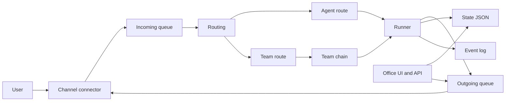
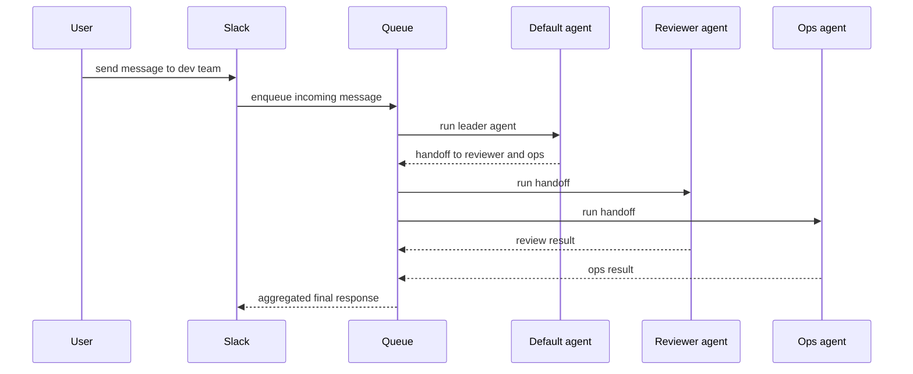
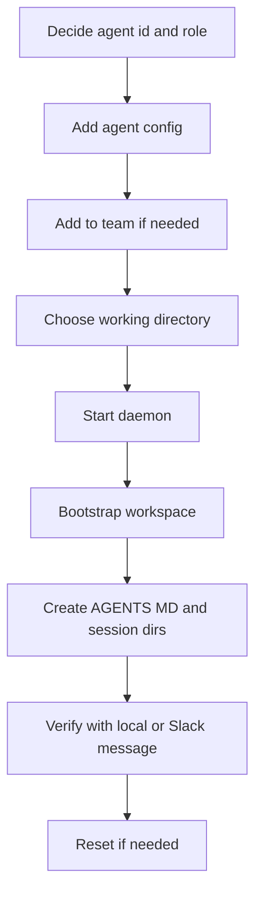

# ClawPod 使い方ガイド

このドキュメントは、`experiments/clawpod` の現行実装を前提に、ClawPod をローカルで立ち上げ、agent/team を定義し、Slack を含むチャネルで運用する手順を 1 本にまとめたものです。

設計判断そのものは [DESIGN_JA.md](./DESIGN_JA.md) を参照してください。こちらは使い方に絞っています。

対象:

- ClawPod をローカルで試したい
- 複数 agent のチームを作りたい
- Slack で受信して agent team に流したい
- Office 画面と API を使いたい
- 新しい agent をオンボーディングしたい

## 1. ClawPod の全体像

ClawPod は、TinyClaw 系の「常駐 daemon + queue + 複数 agent + 複数チャネル」構成を Rust で実装したランタイムです。

現在の主要要素:

- `runtime`: CLI エントリポイント
- `queue`: `incoming -> processing -> outgoing -> dead_letter`
- `routing`: `@agent` / `@team` ルーティング
- `team`: team chain と handoff / fan-out
- `runner`: Claude / Codex / custom / mock 実行
- `telegram` / `discord` / `slack`: チャネル接続
- `server`: Office API と簡易ダッシュボード
- `agent`: workspace bootstrap と reset
- `store`: JSON 1 ファイルによる state 永続化



## 2. まずローカルで動かす

最初の確認は `mock` provider を使うのが最短です。外部 API キーなしで、queue、routing、team chain、Office まで確認できます。

### 2.1 起動前提

- Rust / Cargo
- `cargo run -p runtime -- doctor` が実行できること
- 本番 provider を使う場合だけ `claude` または `codex` CLI

### 2.2 ローカル smoke

ターミナル 1:

```bash
cd experiments/clawpod

cargo run -p runtime -- \
  --config examples/local-smoke.toml \
  daemon
```

ターミナル 2:

```bash
cd experiments/clawpod

cargo run -p runtime -- \
  --config examples/local-smoke.toml \
  enqueue \
  --channel local \
  --sender alice \
  --sender-id alice_1 \
  --peer-id alice_1 \
  --message "hello from local smoke"
```

確認ポイント:

- `./.clawpod-local/queue/outgoing/*.json` が生成される
- `http://127.0.0.1:3777/office` が開ける
- `curl http://127.0.0.1:3777/api/tasks` で実行履歴が見える

### 2.3 本物の agent をローカルで試す

`mock` ではなく、実際に `claude` や `codex` をローカル CLI として呼び出して試すこともできます。Slack などの外部チャネルは不要です。

やり方:

1. `clawpod.toml` で agent の `provider` を `anthropic` または `openai` にする
2. `claude --version` または `codex --version` が通る状態にする
3. `daemon` を起動する
4. `channel=local` で `enqueue` する

例:

```bash
cd experiments/clawpod

cargo run -p runtime -- daemon

cargo run -p runtime -- enqueue \
  --channel local \
  --sender alice \
  --sender-id alice_1 \
  --peer-id alice_1 \
  --message "@default これを要約して"
```

この場合の agent 実行は次の形です。

- `anthropic`: `claude --dangerously-skip-permissions ...`
- `openai`: `codex exec ...`

つまり、ローカルでも十分試せます。外部チャネルが必要なのは Slack / Discord / Telegram の接続確認をしたいときだけです。

## 3. ディレクトリ構成

デフォルトでは `~/.clawpod` 配下に runtime 状態を持ちます。

```text
~/.clawpod/
  clawpod.toml
  queue/
    incoming/
    processing/
    outgoing/
    dead_letter/
  workspace/
    default/
    reviewer/
  files/
  state/
    clawpod-state.json
  logs/
    events.jsonl
  runs/
```

役割:

- `clawpod.toml`: runtime 設定
- `queue/`: 実際のメッセージ搬送
- `workspace/`: agent ごとの作業ディレクトリ
- `state/clawpod-state.json`: tasks, runs, sessions, chatroom, events の永続化
- `logs/events.jsonl`: イベントログ

## 4. agent を作る

ClawPod の agent は `agents.<agent_id>` で定義します。最低限必要なのは `name`, `provider`, `model` です。

working directory は `<workspace_dir>/<agent_id>` から自動解決されます（tinyclaw と同じ方式）。

例:

```toml
[agents.default]
name = "Default"
provider = "anthropic"
model = "claude-sonnet-4-5"

[agents.reviewer]
name = "Reviewer"
provider = "openai"
model = "gpt-5"

[agents.ops]
name = "Ops"
provider = "anthropic"
model = "claude-sonnet-4-5"
```

補足:

- `provider` は `anthropic`, `openai`, `custom`, `mock`
- agent workspace は `<workspace_dir>/<agent_id>` に自動作成される
- `system_prompt` や `prompt_file` を持たせることもできる

ClawPod は初回実行時に agent workspace を bootstrap します。各 agent 配下には次が作られます。

- `AGENTS.md`
- `heartbeat.md`
- `.clawpod/SOUL.md`
- `.claude/`
- `.agents/`
- `memory/`
- `sessions/`

## 5. team を作る

team は `teams.<team_id>` で定義します。`leader_agent` はチームの開始 agent です。

例:

```toml
[teams.dev]
name = "Development"
leader_agent = "default"
agents = ["default", "reviewer", "ops"]
```

メッセージの流れ:

- ユーザーが `@dev バグを直して` と送る
- `leader_agent` の `default` が最初に受ける
- `default` が `[@reviewer: 差分をレビューして]` と返す
- ClawPod が reviewer に handoff する
- handoff が複数なら fan-out で並列実行する



## 6. ルーティングの書き方

### 6.1 単独 agent に送る

```text
@default この issue を調査して
@reviewer この PR を見て
```

### 6.2 team に送る

```text
@dev この障害を切り分けして
```

### 6.3 team 内 handoff

agent の応答内で次を使います。

```text
[@reviewer: この変更のレビューをして]
```

複数 handoff を入れると fan-out になります。

```text
[@reviewer: 差分確認]
[@ops: デプロイ影響確認]
```

## 7. バインディングで固定ルーティングする

prefix を毎回書きたくない場合は `bindings` を使います。特定 channel / peer / account を特定 agent に固定できます。

例:

```toml
[[bindings]]
agent_id = "ops"

[bindings.match]
channel = "slack"
peer_id = "C0123456789"
```

この設定では、指定 Slack channel から来たメッセージは `@ops` 扱いになります。

使い分け:

- `@agent` / `@team`: 明示的に振り分けたいとき
- `bindings`: チャネル単位で常に同じ担当へ流したいとき

## 8. Slack を使う

ClawPod の Slack connector は Bot Token と App Token の 2 つを使います。内部的には Socket Mode で受信し、`chat.postMessage` と file upload で返信します。

設定例:

```toml
[channels.slack]
bot_token = "xoxb-..."                # or bot_token_env = "SLACK_BOT_TOKEN"
app_token = "xapp-..."                # or app_token_env = "SLACK_APP_TOKEN"

[channels.slack.access]
dm_policy = "pairing"                 # open | allowlist | pairing | disabled
group_policy = "mention_only"         # disabled | mention_only | allowlist | open
allow_from = ["U0123456789"]          # optional sender IDs for DM allowlist
group_allow_from = ["U0123456789"]    # optional sender IDs for group allowlist
```

実装上の前提:

- Bot Token が必要
- App Token が必要
- Socket Mode を有効にする
- `message` と `app_mention` 系イベントを受けられるようにする
- メッセージ送信とファイル送受信に必要な権限を付与する

運用イメージ:

- DM では `peer_id` は DM channel ベースになる
- thread 返信は `channel|thread_ts` 単位で session が分かれる
- チャネル内では `@default` や `@dev` を書く

最小起動:

```bash
cd experiments/clawpod
cargo run -p runtime -- daemon
```

Slack connector は daemon 起動時に自動で立ち上がります。`bot_token` / `app_token` または `bot_token_env` / `app_token_env` が未設定なら自動で無効化されます。

## 9. Discord / Telegram を使う

設定形式は同じですが、Discord は `guild_id` と `mention_only` を追加で持てます。

```toml
[channels.telegram]
bot_token = "..."                     # or bot_token_env = "TELEGRAM_BOT_TOKEN"
[channels.telegram.access]
dm_policy = "pairing"
group_policy = "mention_only"

[channels.discord]
bot_token = "..."                     # or bot_token_env = "DISCORD_BOT_TOKEN"
guild_id = "123456789012345678" # optional
mention_only = true            # optional
[channels.discord.access]
dm_policy = "allowlist"
allow_from = ["123456789012345678"]
group_policy = "mention_only"
```

`daemon` 起動時に各 connector が立ち上がり、token または token 用 env が未設定ならその connector だけ無効になります。

sender access policy の意味:

- `dm_policy = "open"`: DM は誰でも通す
- `dm_policy = "allowlist"`: `allow_from` にある sender ID だけ通す
- `dm_policy = "pairing"`: 未承認 sender は pending approval に入り、Office の Settings から承認するまで止める
- `dm_policy = "disabled"`: DM を受けない
- `group_policy = "mention_only"`: bot mention がある group / thread だけ通す
- `group_policy = "allowlist"`: `group_allow_from` にある sender ID だけ通す
- `group_policy = "disabled"`: group / thread を受けない

pairing を使う場合:

- 未承認 DM sender は `Office -> Settings -> Pending Approvals` に出る
- 承認するとその channel + sender ID の組み合わせが通る
- pairing は cross-channel identity merge ではなく、channel ごとの sender gate

Discord の補足:

- `guild_id`: 特定サーバーだけに制限したいときに使う
- `mention_only = true`: サーバーチャンネルでは bot mention がある投稿だけ拾う
- thread 内の投稿は thread 単位で session が分かれる
- 返信は元メッセージへの reply として送られる

Discord Bot 側で必要なもの:

- Bot Token
- `MESSAGE CONTENT INTENT`
- `Send Messages`, `Read Message History`, `Attach Files` 相当の権限

## 10. Office を使う

Office は簡易ダッシュボードと API です。`daemon` で同時起動してもよく、単独起動もできます。

標準設定:

```toml
[server]
enabled = true
api_port = 3777
host = "127.0.0.1"
allow_public_bind = false
```

認証を有効にする例:

```toml
[server.auth]
enabled = true
token_env = "CLAWPOD_OFFICE_TOKEN"
```

補足:

- `host = "127.0.0.1"` が default
- `0.0.0.0` や外部 IP を使う場合は `allow_public_bind = true` が必要
- public bind 時は `server.auth.enabled = true` も必須
- Office/API token は `Authorization: Bearer <token>` または `?token=...` で渡せる

単独起動:

```bash
cd experiments/clawpod
cargo run -p runtime -- office
```

代表的な URL:

- `http://127.0.0.1:3777/office`
- `GET /health`
- `GET /api/health`
- `GET /api/settings`
- `PUT /api/settings`
- `GET /api/agents`
- `GET /api/teams`
- `GET /api/queue/status`
- `GET /api/responses`
- `POST /api/responses`
- `GET /api/tasks`
- `GET /api/logs/events`
- `GET /api/chatroom/:team_id`
- `POST /api/chatroom/:team_id`
- `GET /api/events/stream`

できること:

- 設定確認
- pending response の確認
- 手動応答の投入
- task / event / chatroom の確認
- agent / team 設定の参照

## 11. オンボーディング手順

新しい agent を増やすときは、設定を足して daemon を再起動するのが基本です。



実際の手順:

1. `agents.<agent_id>` を `clawpod.toml` に追加する
2. 必要なら `teams.<team_id>.agents` に加える
3. 必要なら `leader_agent` を変更する
4. `daemon` を起動する
5. `workspace/<agent_id>` が作られたことを確認する
6. `@agent_id` または `@team_id` で疎通確認する

トラブル時の reset:

```bash
cd experiments/clawpod
cargo run -p runtime -- reset --agent reviewer
```

`reset` は次を行います。

- `workspace/<agent>/sessions` を削除して作り直す
- `.clawpod/reset.flag` を立てる
- 永続 session 状態をクリアする

## 12. custom provider を使う

ClawPod は Claude / OpenAI 互換の custom endpoint を扱えます。

例:

```toml
[custom_providers.internal_llm]
name = "internal-llm"
harness = "openai"
base_url = "https://example.internal/v1"
api_key = "secret"
api_key_env = "INTERNAL_LLM_API_KEY"
model = "gpt-4.1-mini"

[agents.internal]
name = "Internal"
provider = "custom"
provider_id = "internal_llm"
model = "gpt-4.1-mini"
```

使い分け:

- `provider = "anthropic"`: `claude` CLI を使う
- `provider = "openai"`: `codex` 側ハーネスを使う
- `provider = "custom"`: `custom_providers.<id>` を参照する
- `provider = "mock"`: ローカル smoke 用

## 13. 実運用のおすすめ構成

最初は次の順で入れるのが安全です。

1. `mock` で queue と team chain を確認
2. `Slack` を 1 workspace でつなぐ
3. `default` と `reviewer` の 2 agent で team を作る
4. Office で task と event を監視する
5. bindings を入れてルーティングを固定化する

サンプル構成:

```toml
[daemon]
home_dir = "~/.clawpod"
workspace_dir = "~/.clawpod/workspace"
poll_interval_ms = 1000
max_concurrent_runs = 4

[server]
enabled = true
api_port = 3777
host = "127.0.0.1"
allow_public_bind = false

[queue]
mode = "collect"
max_retries = 3
backoff_base_ms = 500
dead_letter_enabled = true

[session]
dm_scope = "per-channel-peer"
main_key = "main"

[runner]
default_provider = "anthropic"
timeout_sec = 120

[agents.default]
name = "Default"
provider = "anthropic"
model = "claude-sonnet-4-5"

[agents.reviewer]
name = "Reviewer"
provider = "openai"
model = "gpt-5"

[teams.dev]
name = "Development"
leader_agent = "default"
agents = ["default", "reviewer"]

[channels.slack]
bot_token_env = "SLACK_BOT_TOKEN"
app_token_env = "SLACK_APP_TOKEN"
```

## 14. よく使うコマンド

runtime 状態確認:

```bash
cd experiments/clawpod
cargo run -p runtime -- doctor
cargo run -p runtime -- status
cargo run -p runtime -- health
cargo run -p runtime -- logs --source events
```

daemon 起動:

```bash
cargo run -p runtime -- daemon
```

Office のみ起動:

```bash
cargo run -p runtime -- office
```

service 管理:

```bash
cargo run -p runtime -- service install
cargo run -p runtime -- service start
cargo run -p runtime -- service status
```

手動 enqueue:

```bash
cargo run -p runtime -- enqueue \
  --channel local \
  --sender alice \
  --sender-id alice_1 \
  --peer-id alice_1 \
  --message "@dev この障害を調査して"
```

agent reset:

```bash
cargo run -p runtime -- reset --agent default
```

## 15. 運用上の注意

- `daemon` を起動しないと queue processor と各 channel connector は動かない
- `office` 単独起動では queue を処理しない
- token 未設定の connector は自動で無効化される
- session は `state/clawpod-state.json` に永続化される
- agent の会話を切りたいときは `reset --agent <id>` を使う
- 外部 provider を使う前に、まず `mock` で flow を確認したほうが安全

## 16. 最初の一歩

最短で試すならこの順です。

1. `examples/local-smoke.toml` で `daemon` を起動する
2. `enqueue` で `@dev hello` を流す
3. `office` で task と response を確認する
4. `~/.clawpod/clawpod.toml` を作って Slack token を入れる
5. `default` と `reviewer` の 2 agent team を作る
6. Slack から `@dev` で投げる

これで ClawPod の基本運用は回せます。
