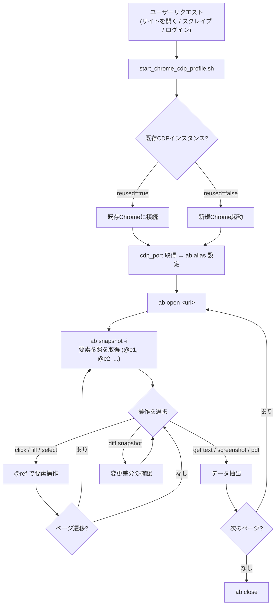

# Browser Automation with agent-browser

## Core Workflow



Every browser automation follows this pattern:

1. **Connect or Launch**: `start_chrome_cdp_profile.sh` — existing CDP Chrome is reused automatically, otherwise a new one is launched
2. **Set alias**: `ab() { agent-browser --cdp "$cdp_port" "$@"; }` で短縮
3. **Navigate**: `ab open <url>`
4. **Snapshot**: `ab snapshot -i` (get element refs like `@e1`, `@e2`)
5. **Interact**: Use refs to click, fill, select
6. **Re-snapshot**: After navigation or DOM changes, get fresh refs

```bash
# 1. Connect to existing Chrome or launch new one (always run this first)
eval "$(.claude/skills/agent-browser/scripts/start_chrome_cdp_profile.sh --open-url https://example.com/form)"
# reused=true  → connected to existing Chrome
# reused=false → launched new Chrome
ab() { agent-browser --cdp "$cdp_port" "$@"; }

# 2. Operate
ab snapshot -i
# Output: @e1 [input type="email"], @e2 [input type="password"], @e3 [button] "Submit"

ab fill @e1 "user@example.com"
ab fill @e2 "password123"
ab click @e3
ab wait --load networkidle
ab snapshot -i  # Check result
```

## Command Chaining

Commands can be chained with `&&` in a single shell invocation. The browser persists between commands via a background daemon, so chaining is safe and more efficient than separate calls.

```bash
# Chain open + wait + snapshot in one call
ab open https://example.com && ab wait --load networkidle && ab snapshot -i

# Chain multiple interactions
ab fill @e1 "user@example.com" && ab fill @e2 "password123" && ab click @e3

# Navigate and capture
ab open https://example.com && ab wait --load networkidle && ab screenshot page.png
```

**When to chain:** Use `&&` when you don't need to read the output of an intermediate command before proceeding (e.g., open + wait + screenshot). Run commands separately when you need to parse the output first (e.g., snapshot to discover refs, then interact using those refs).

## Essential Commands

All commands below assume the `ab` alias is set after Chrome launch (see Core Workflow).

```bash
# Navigation
ab open <url>              # Navigate (aliases: goto, navigate)
ab close                   # Close browser

# Snapshot
ab snapshot -i             # Interactive elements with refs (recommended)
ab snapshot -i -C          # Include cursor-interactive elements (divs with onclick, cursor:pointer)
ab snapshot -s "#selector" # Scope to CSS selector

# Interaction (use @refs from snapshot)
ab click @e1               # Click element
ab click @e1 --new-tab     # Click and open in new tab
ab fill @e2 "text"         # Clear and type text
ab type @e2 "text"         # Type without clearing
ab select @e1 "option"     # Select dropdown option
ab check @e1               # Check checkbox
ab press Enter             # Press key
ab keyboard type "text"    # Type at current focus (no selector)
ab keyboard inserttext "text"  # Insert without key events
ab scroll down 500         # Scroll page
ab scroll down 500 --selector "div.content"  # Scroll within a specific container

# Get information
ab get text @e1            # Get element text
ab get url                 # Get current URL
ab get title               # Get page title

# Wait
ab wait @e1                # Wait for element
ab wait --load networkidle # Wait for network idle
ab wait --url "**/page"    # Wait for URL pattern
ab wait 2000               # Wait milliseconds

# Downloads
ab download @e1 ./file.pdf          # Click element to trigger download
ab wait --download ./output.zip     # Wait for any download to complete
ab --download-path ./downloads open <url>  # Set default download directory

# Capture
ab screenshot              # Screenshot to temp dir
ab screenshot --full       # Full page screenshot
ab screenshot --annotate   # Annotated screenshot with numbered element labels
ab pdf output.pdf          # Save as PDF

# Diff (compare page states)
ab diff snapshot                          # Compare current vs last snapshot
ab diff snapshot --baseline before.txt    # Compare current vs saved file
ab diff screenshot --baseline before.png  # Visual pixel diff
ab diff url <url1> <url2>                 # Compare two pages
ab diff url <url1> <url2> --wait-until networkidle  # Custom wait strategy
ab diff url <url1> <url2> --selector "#main"  # Scope to element
```

## Common Patterns

### Form Submission

```bash
ab open https://example.com/signup
ab snapshot -i
ab fill @e1 "Jane Doe"
ab fill @e2 "jane@example.com"
ab select @e3 "California"
ab check @e4
ab click @e5
ab wait --load networkidle
```

### Authentication with State Persistence

```bash
# Login once and save state
ab open https://app.example.com/login
ab snapshot -i
ab fill @e1 "$USERNAME"
ab fill @e2 "$PASSWORD"
ab click @e3
ab wait --url "**/dashboard"
ab state save auth.json

# Reuse in future sessions (same CDP profile keeps cookies)
ab state load auth.json
ab open https://app.example.com/dashboard
```

### Data Extraction

```bash
ab open https://example.com/products
ab snapshot -i
ab get text @e5           # Get specific element text
ab get text body > page.txt  # Get all page text

# JSON output for parsing
ab snapshot -i --json
ab get text @e1 --json
```

### Parallel Workers (Multiple CDP Profiles)

```bash
# Worker 1
eval "$(.claude/skills/agent-browser/scripts/start_chrome_cdp_profile.sh --port-base 9400 --port-max 9410)"
ab1() { agent-browser --cdp "$cdp_port" "$@"; }
ab1 open https://site-a.com

# Worker 2
eval "$(.claude/skills/agent-browser/scripts/start_chrome_cdp_profile.sh --port-base 9400 --port-max 9410)"
ab2() { agent-browser --cdp "$cdp_port" "$@"; }
ab2 open https://site-b.com
```

### Fixed Port (Reuse Existing Profile)

```bash
# Use a fixed port to reconnect to an existing profile
.claude/skills/agent-browser/scripts/start_chrome_cdp_profile.sh \
  --port 9400 --open-url https://x.com/home
ab() { agent-browser --cdp 9400 "$@"; }
```

### Color Scheme (Dark Mode)

```bash
# Persistent dark mode via flag (applies to all pages and new tabs)
ab --color-scheme dark open https://example.com

# Or via environment variable
AGENT_BROWSER_COLOR_SCHEME=dark ab open https://example.com

# Or set during session (persists for subsequent commands)
ab set media dark
```

### Visual Browser (Debugging)

```bash
# Chrome is already headed via CDP profile — use highlight/record for debugging
ab highlight @e1          # Highlight element
ab record start demo.webm # Record session
ab profiler start         # Start Chrome DevTools profiling
ab profiler stop trace.json # Stop and save profile (path optional)
```

### Local Files (PDFs, HTML)

```bash
# Open local files with file:// URLs
ab --allow-file-access open file:///path/to/document.pdf
ab --allow-file-access open file:///path/to/page.html
ab screenshot output.png
```

### Rich Text Editors with Inline Images / Metadata

For CMS editors such as Medium, Dev.to, or Substack, first read [references/cms-editors.md](references/cms-editors.md).

Use these hard rules:

- Work on one platform and one editor tab at a time. Parallel tab manipulation easily corrupts selection state.
- Treat raw source fields as the source of truth when available. For Dev.to, verify `#article_body_markdown`, not only the rendered preview.
- Do not trust DOM-only changes in rich-text editors. Reopen the draft in a fresh tab or page and verify the change server-side.
- If `ab click` / `ab upload` is blocked by overlays, hidden inputs, or zero-sized controls, fall back to Playwright-over-CDP instead of retrying blind.

```bash
# Reuse the playwright-core bundled with agent-browser when ab alone is not enough
PW_CORE="$(npm root -g)/agent-browser/node_modules/playwright-core"
PW_CORE="$PW_CORE" node - <<'EOF'
const { chromium } = require(process.env.PW_CORE);
(async () => {
  const browser = await chromium.connectOverCDP('http://127.0.0.1:9400');
  const page = browser.contexts()[0].pages()[0];
  await page.bringToFront();
  // Inspect page state or interact with hidden inputs / file choosers here.
  await browser.close();
})();
EOF
```

For end-to-end Medium / Dev.to / Substack article drafting, prefer the dedicated `cms-draft-crossposting` skill when available.

### iOS Simulator (Mobile Safari)

```bash
# List available iOS simulators
agent-browser device list

# Launch Safari on a specific device
agent-browser -p ios --device "iPhone 16 Pro" open https://example.com

# Same workflow as desktop - snapshot, interact, re-snapshot
agent-browser -p ios snapshot -i
agent-browser -p ios tap @e1          # Tap (alias for click)
agent-browser -p ios fill @e2 "text"
agent-browser -p ios swipe up         # Mobile-specific gesture

# Take screenshot
agent-browser -p ios screenshot mobile.png

# Close session (shuts down simulator)
agent-browser -p ios close
```

**Requirements:** macOS with Xcode, Appium (`npm install -g appium && appium driver install xcuitest`)

**Real devices:** Works with physical iOS devices if pre-configured. Use `--device "<UDID>"` where UDID is from `xcrun xctrace list devices`.

> **Note:** iOS Simulator uses `agent-browser` directly (not `ab` alias) as it does not use CDP connection.

## Diffing (Verifying Changes)

Use `diff snapshot` after performing an action to verify it had the intended effect. This compares the current accessibility tree against the last snapshot taken in the session.

```bash
# Typical workflow: snapshot -> action -> diff
ab snapshot -i          # Take baseline snapshot
ab click @e2            # Perform action
ab diff snapshot        # See what changed (auto-compares to last snapshot)
```

For visual regression testing or monitoring:

```bash
# Save a baseline screenshot, then compare later
ab screenshot baseline.png
# ... time passes or changes are made ...
ab diff screenshot --baseline baseline.png

# Compare staging vs production
ab diff url https://staging.example.com https://prod.example.com --screenshot
```

`diff snapshot` output uses `+` for additions and `-` for removals, similar to git diff. `diff screenshot` produces a diff image with changed pixels highlighted in red, plus a mismatch percentage.

## Timeouts and Slow Pages

The default Playwright timeout is 25 seconds for local browsers. This can be overridden with the `AGENT_BROWSER_DEFAULT_TIMEOUT` environment variable (value in milliseconds). For slow websites or large pages, use explicit waits instead of relying on the default timeout:

```bash
# Wait for network activity to settle (best for slow pages)
ab wait --load networkidle

# Wait for a specific element to appear
ab wait "#content"
ab wait @e1

# Wait for a specific URL pattern (useful after redirects)
ab wait --url "**/dashboard"

# Wait for a JavaScript condition
ab wait --fn "document.readyState === 'complete'"

# Wait a fixed duration (milliseconds) as a last resort
ab wait 5000
```

When dealing with consistently slow websites, use `wait --load networkidle` after `open` to ensure the page is fully loaded before taking a snapshot. If a specific element is slow to render, wait for it directly with `wait <selector>` or `wait @ref`.

## Cleanup

Always close your browser session when done to avoid leaked processes:

```bash
ab close
```

If a previous session was not closed properly, the daemon may still be running. Use `ab close` to clean it up before starting new work. For parallel workers, close each alias separately.

## Ref Lifecycle (Important)

Refs (`@e1`, `@e2`, etc.) are invalidated when the page changes. Always re-snapshot after:

- Clicking links or buttons that navigate
- Form submissions
- Dynamic content loading (dropdowns, modals)

```bash
ab click @e5              # Navigates to new page
ab snapshot -i            # MUST re-snapshot
ab click @e1              # Use new refs
```

## Annotated Screenshots (Vision Mode)

Use `--annotate` to take a screenshot with numbered labels overlaid on interactive elements. Each label `[N]` maps to ref `@eN`. This also caches refs, so you can interact with elements immediately without a separate snapshot.

```bash
ab screenshot --annotate
# Output includes the image path and a legend:
#   [1] @e1 button "Submit"
#   [2] @e2 link "Home"
#   [3] @e3 textbox "Email"
ab click @e2              # Click using ref from annotated screenshot
```

Use annotated screenshots when:
- The page has unlabeled icon buttons or visual-only elements
- You need to verify visual layout or styling
- Canvas or chart elements are present (invisible to text snapshots)
- You need spatial reasoning about element positions

## Semantic Locators (Alternative to Refs)

When refs are unavailable or unreliable, use semantic locators:

```bash
ab find text "Sign In" click
ab find label "Email" fill "user@test.com"
ab find role button click --name "Submit"
ab find placeholder "Search" type "query"
ab find testid "submit-btn" click
```

## JavaScript Evaluation (eval)

Use `eval` to run JavaScript in the browser context. **Shell quoting can corrupt complex expressions** -- use `--stdin` or `-b` to avoid issues.

```bash
# Simple expressions work with regular quoting
ab eval 'document.title'
ab eval 'document.querySelectorAll("img").length'

# Complex JS: use --stdin with heredoc (RECOMMENDED)
ab eval --stdin <<'EVALEOF'
JSON.stringify(
  Array.from(document.querySelectorAll("img"))
    .filter(i => !i.alt)
    .map(i => ({ src: i.src.split("/").pop(), width: i.width }))
)
EVALEOF

# Alternative: base64 encoding (avoids all shell escaping issues)
ab eval -b "$(echo -n 'Array.from(document.querySelectorAll("a")).map(a => a.href)' | base64)"
```

**Why this matters:** When the shell processes your command, inner double quotes, `!` characters (history expansion), backticks, and `$()` can all corrupt the JavaScript before it reaches agent-browser. The `--stdin` and `-b` flags bypass shell interpretation entirely.

**Rules of thumb:**
- Single-line, no nested quotes -> regular `eval 'expression'` with single quotes is fine
- Nested quotes, arrow functions, template literals, or multiline -> use `eval --stdin <<'EVALEOF'`
- Programmatic/generated scripts -> use `eval -b` with base64

## Configuration File

Create `agent-browser.json` in the project root for persistent settings:

```json
{
  "headed": true,
  "proxy": "http://localhost:8080",
  "profile": "./browser-data"
}
```

Priority (lowest to highest): `~/.agent-browser/config.json` < `./agent-browser.json` < env vars < CLI flags. Use `--config <path>` or `AGENT_BROWSER_CONFIG` env var for a custom config file (exits with error if missing/invalid). All CLI options map to camelCase keys (e.g., `--executable-path` -> `"executablePath"`). Boolean flags accept `true`/`false` values (e.g., `--headed false` overrides config). Extensions from user and project configs are merged, not replaced.

## Deep-Dive Documentation

| Reference | When to Use |
|-----------|-------------|
| [references/commands.md](references/commands.md) | Full command reference with all options |
| [references/snapshot-refs.md](references/snapshot-refs.md) | Ref lifecycle, invalidation rules, troubleshooting |
| [references/session-management.md](references/session-management.md) | Parallel sessions, state persistence, concurrent scraping |
| [references/authentication.md](references/authentication.md) | Login flows, OAuth, 2FA handling, state reuse |
| [references/video-recording.md](references/video-recording.md) | Recording workflows for debugging and documentation |
| [references/profiling.md](references/profiling.md) | Chrome DevTools profiling for performance analysis |
| [references/proxy-support.md](references/proxy-support.md) | Proxy configuration, geo-testing, rotating proxies |
| [references/cdp-profile.md](references/cdp-profile.md) | CDP profile launch, auto port, parallel workers |

## Ready-to-Use Templates

| Template | Description |
|----------|-------------|
| [templates/form-automation.sh](templates/form-automation.sh) | Form filling with validation |
| [templates/authenticated-session.sh](templates/authenticated-session.sh) | Login once, reuse state |
| [templates/capture-workflow.sh](templates/capture-workflow.sh) | Content extraction with screenshots |

```bash
./templates/form-automation.sh https://example.com/form
./templates/authenticated-session.sh https://app.example.com/login
./templates/capture-workflow.sh https://example.com ./output
```
